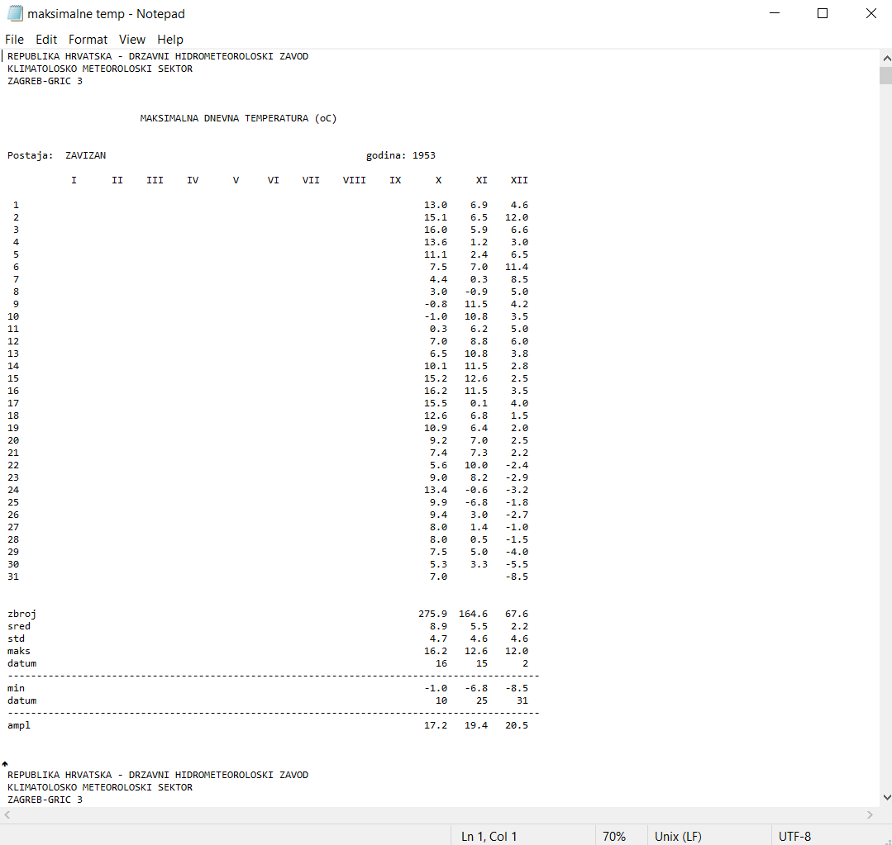

# messy_datasets

Wrangling ugly messy datasets to an analysable format.

1-DHMZ_meteo: 
A dataset containing maximal daily temperatures measured on Velebit in Croatia, 1953 to 2018. Very poorly formated. The end product required mean temperatures per month of each year.

Raw data
